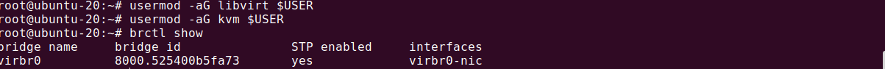
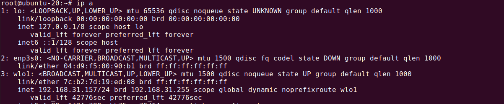

# **KVM-Virtualization-Ubuntu-20.04**

### This process demonstrates Installing VMs on Ubuntu 20.04 using KVM. All the commands are run with `sudo` privileges and to run commands as `sudo` we need to use the following command

```bash
sudo su -
```

### **1.** Checking if the host machine supports virtualization. If it is more than `0` then our machine can support virtualization

```bash
egrep -c '(vmx|svm)' /proc/cpuinfo
```

### Here we can see our machine supports KVM as the output is 12


### **2**. Then we need to install the following packages

```bash
apt install qemu-kvm libvirt-daemon-system libvirt-clients bridge-utils virtinst virt-manager qemu-system
```

- `qemu-kvm` - software that provides hardware emulation for the KVM hypervisor.

- `libvirt-daemon-system`- configuration files to run the libvirt daemon as a system service.

- `libvirt-clients` - software for managing virtualization platforms.

- `bridge-utils` - a set of command-line tools for configuring ethernet bridges.

- `virtinst` - a set of command-line tools for creating virtual machines.

- `virt-manager` - an easy-to-use GUI interface and supporting command-line utilities for managing virtual machines through libvirt

- `qemu-system` - tools for configuring qemu

### **3.** Once the packages are installed, the libvirt daemon will start automatically. We can verify it by this command

```bash
systemctl is-active libvirtd
```

Here in the output, we can see that it is activated


### **4.** To be able to create and manage virtual machines, we’ll need to add our users to the “libvirt” and “kvm” groups. To do that we use these commands

```bash
usermod -aG libvirt $USER
usermod -aG kvm $USER
usermod -aG libvirt-qemu $USER
```

`$USER` is an environment variable that holds the name of the currently logged-in user. i.e in this case `rizwan`

### **5.** Lastly with we can check the network connectivity by the following command

```bash
brctl show
```

In the output, a bridge named `virbr0` is created during the installation process. This device uses NAT to connect the guests' machines to the outside world



We will need to configure our networks now

### **6.** The `ip a` will show us our network interface



### **7.** We can see our interface is `enp0s3`. In order to tell Ubuntu that we want our connection to be bridged, we'll need to edit the network interface configuration file

Using a text editor `vim` we will edit this one file.

```bash
vim /etc/network/interfaces
```

There might be one or two lines by default. We remove everything from the file and add the following lines

```bash
auto br0
iface enp0s3 inet manual
iface br0 inet dhcp
   bridge_ports enp0s3
```

We save the file with `wq!` and restart our machine.

### **8.** Now we can use the GUI to install a guest VM or use the following command

```bash
 virt-install --name virhVM --memory 2048 --vcpus 2 --disk size=10 --cdrom /home/rizwan/Downloads/ubuntu-18.04.4-live-server-amd64.iso –os-variant ubuntu18.04
```

This will create a VM with `2GB RAM, 10GB Storage and 2 CPUs`. After installing VM we need to access it from our host machine. So, we need to install `openssh-server` on the guest with the following command.

```bash
apt install openssh-server
```

Now we will find out the `IP` address of our guest machine by typing

```bash
ifconfig
```

we can see the IP address of our machine here. It's `192.168.122.31`


From our `host` machine we can access it by the following command

```bash
ssh username@ip_address
```

To change the vm name we can use

```bash
hostnamectl set-hostname 'new-name'
```

In our case, that is `ssh rizwan@192.168.122.31`

We can change a folder'r permission with the folloing command

```bash
sudo chmod -R 757 /root
```
